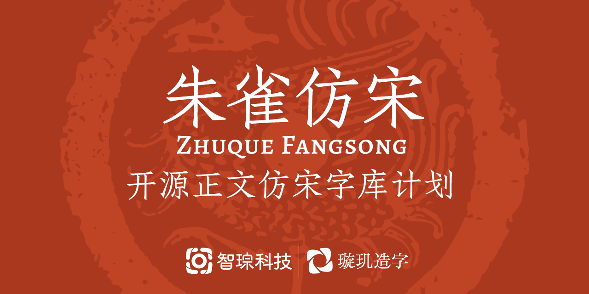

# Zhuque Fangsong 朱雀仿宋 / Suzaku Sōchō 朱雀宋朝

“Zhuque Fangsong / Suzaku Sōchō” is a WIP open-source [Fangsong/Sōchōtai](https://en.wikipedia.org/wiki/Imitation_Song) typeface project by TrionesType. Fangsong, as one of the four basic Chinese type style, has been lacking an open-source solution for long. With “Zhuque Fangsong”, we hope to fill this gap and contribute to the open-source software and TeX communities.

While Fangsong types gained great popularity in the early 20th century, most Chinese Fangsong faces today converged into derivatives of “Huafeng Zhensong (華豐真宋)”. However, “Zhuque Fangsong” is a revival of the metal type “Nansong (南宋)” aiming to provide a refreshing option that caters to modern typographic needs.

Zhuque is currently in its early stages of development as a “technical preview”. Therefore, both the design and the charset coverage are subject to changes, and may not necessarily represent the final version. We highly welcome user feedback and suggestions to help improve the typeface.

## Let users define

We welcome suggestions for the future development of Zhuque, and designed a [questionnaire (in Chinese)](https://www.wjx.cn/vm/QQgadJY.aspx) to gather user feedback openly.

This has only been made possible with TrionesType’s new technology. TrionesType’s designers integrate the AI-powered tools into their design process, and thus, we are enabled to achieve this huge CJK project with limited resources while allowing for iterative design on a large charset.

Despite the technological advancement, our ambitious goals of the Zhuque project result in an overwhelming workload. To ensure sustainable and efficient development of Zhuque, we are seeking support, and hope to make quicker strides towards achieving our ambition.

## Downloading the fonts

We will update the download links on the [Releases](https://github.com/TrionesType/zhuque/releases) page.

## Design story

The development of an open-source Fangsong typeface was conceived in early 2021 as a more challenging and meaningful project following the [Glow Sans](https://github.com/welai/glow-sans) project. With advancements in our design research and tech development, particularly the progress of generative AI, this idea has become a reality.

Zhuque is a modern interpretation of the Fangsong movable type “Nansong (南宋),” designed by the “Baisong Type Foundry & Printing Press (百宋鑄字印刷局)” in 1932 and was widely used in books and journals. “Nansong” has a unique style characterized by a slightly lower right gravity, a tightened structure (small Zhonggong \[中宫\] or Futokoro \[懐\]), and relaxed falling strokes. It also features strong contrasts in stroke thickness, giving it a subtle and elegant style that is perfect for both display and text.

Zhuque is based on “Nansong” but reduces stroke contrast while retaining the unique charm of the original as much as possible. The font’s name “Zhuque/Suzaku (朱雀)” refers to the [Vermilion Bird of the South](https://en.wikipedia.org/wiki/Vermilion_Bird), one of the [Four Symbols](https://en.wikipedia.org/wiki/Four_Symbols) of the traditional Chinese constellations. The name is also a nod to the origin of “Nansong” (literally “South Fangsong”), as well as our brand name, “TrionesType (璇璣造字)”, which is also named after a traditional Chinese constellation.

### References

- 孙明远：《中国近现代平面设计和文字设计发展历程研究——从一八〇五年至一九四九年》，厦门大学出版社，2021 年第 1 版，第 168～172 页
- 周博：《中国现代文字设计图史》，北京大学出版社，2018 年第 1 版，第 122～124 页

## License

© 2023 [JadeFoci](https://jadefoci.com/)，released under [SIL Open Font License 1.1](http://scripts.sil.org/OFL).

Zhuque currently extrapolates the [Alegreya](https://github.com/huertatipografica/Alegreya) masters for matching Latin, Cyrillic and Greek. Alegreya is also released under SIL Open Font License 1.1.

> Alegreya is a typeface originally intended for literature. Among its crowning characteristics, it conveys a dynamic and varied rhythm which facilitates the reading of long texts. Also, it provides freshness to the page while referring to the calligraphic letter, not as a literal interpretation, but rather in a contemporary typographic language.
>
> The italic has just as much care and attention to detail in the design as the roman. The bold weights are strong, and the Black weights are really experimental for the genre. There is also a Small Caps sister family.
>
> Not only does Alegreya provide great performance, but also achieves a strong and harmonious text by means of elements designed in an atmosphere of diversity.
> The Alegreya type system is a "super family", originally intended for literature, and includes serif and sans serif sister families.
>
> It supports expert latin, greek and cyrillic character sets and provides advanced typography OpenType features such as small caps, dynamic ligatures and fractions, four set of figures, super and subscript characters, ordinals, localized accent forms for spanish, catalan, guaraní, dutch, turkish, romanian, serbian among others.
>
> Alegreya was chosen at the ATypI Letter2 competition in September 2011, and one of the top 14 text type systems. It was also selected in the 2nd Bienal Iberoamericana de Diseño, competition held in Madrid in 2010 and Tipos Latinos.
>
> Designed by Juan Pablo del Peral for [Huerta Tipográfica](http://www.huertatipografica.com/).

## Zhuque Team

**Designed by:** [YU Junyi](https://github.com/Lottin0113)

**Kana and punctuations:** [HAN Yeongsy](https://github.com/yeongsy)

**Technical support:** [YIN Yehang](https://github.com/celestialphineas), [YU Junyi](https://github.com/Lottin0113)

## About TrionesType

[TrionesType](http://trionestype.com/) is the type foundry of [JadeFoci Technology](https://jadefoci.com/), offering CJK typeface customization, type design tools, AI generation of CJK typefaces, and font engineering services. The name TrionesType originates from the Chinese word [*Xuanji*](https://en.wiktionary.org/wiki/%E7%92%87%E7%92%A3), that bears several meanings: a legendary astronomical device, a Neolithic ratchet-shaped jadeware, and a more common one that inspires our English name – bowl of the Big Dipper. Just as the name suggests, TrionesType set their root into the culture, draw their inspiration from nature, and innovate the world of types with their cutting-edge technology.

- **We are multicultural** – We know the East Asian typographic traditions well, but we understand how to translate the designs across scripts better, especially from Latin to CJK ideographs.

- **We are creative** – Our award-winning type design team are competent to find the best intersection between tradition and modernity for your custom type, whether what you need is a plain sans serif or a playful display face.

- **We are tech-savvy** – CJK type design has long been a time-consuming task for its large charset. TrionesType team come from a computer science lab with years of experience in AI-assisted design. Our cutting-edge technology enables us to create your CJK custom type faster, better, and beyond your expectations.

No matter how technology evolves, we are committed to put **human** to the first priority. We value the designer’s creativity and the user’s experience.

We are excited to work together with you and to create the types belonging to the future.

## Acknowledgements

- Special thanks to Terry Wang’s contribution to the collection and research of “Nansong” types.
- [Siphercase](https://github.com/Siphercase) supplemented some IPA glyphs.
- [LXGW](https://github.com/lxgw)’s [“LXGW Wenkai”](https://github.com/lxgw/LxgwWenKai), [Fontworks Klee One](https://github.com/fontworks-fonts/Klee), and [Source Han Serif](https://github.com/adobe-fonts/source-han-serif). These open-source fonts serve as letterform references for both human designers and AI in the development of this project.